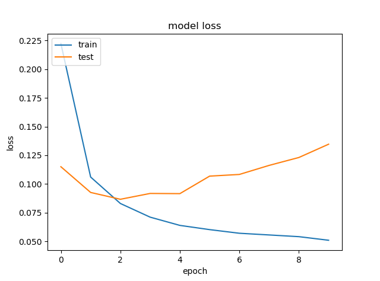
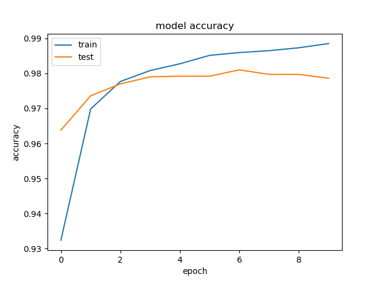
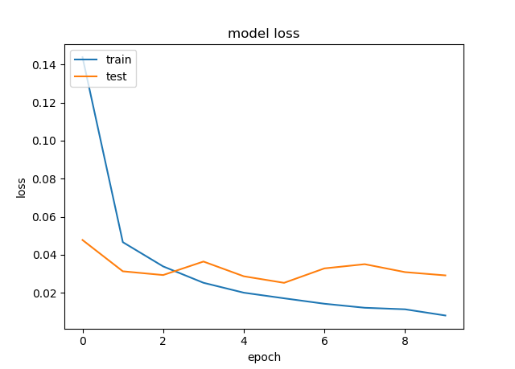
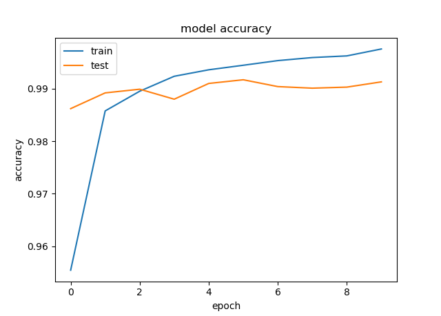

# MNIST-Classification
Using Keras to classify images from the MNIST dataset.

## Results
### MLP (Multilayer Perceptron)
Overfitting is a common issue in deep learning models and despite using Dropout layers this is particularly evident in the loss plot. 
To minimise this the dropout should be increased or regularization layers introduced.

     
     

### CNN (Convolutional Neural Network)
The CNN outperforms the MLP without overfitting. BatchNormalization layers are therefore not included.

     
     

## Getting Started
- Change the ml_model variable at the bottom of [main.py](main.py) to mlp or cnn and run

## Development
- Image classification using MLP and CNN neural networks in Keras
- Model architecture plots available in the 'results/model_architectures' folder
- Evaluation metrics discussed for multi-class problems
